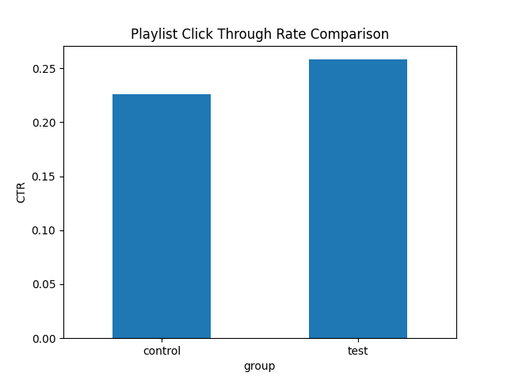

# Apple Music A/B Experiment Analysis

## Overview
This project simulates an A/B experiment to evaluate a proposed Apple Music feature: **Mood-Based Playlist Recommendations**.

The goal is to determine whether personalized playlists based on user mood improve user engagement.

## Experiment Design

Users were randomly split into two groups:

**Control Group**
- Standard Apple Music recommendations

**Test Group**
- Mood-based playlist recommendations

Total users simulated: **1000**

## Metric
The primary metric analyzed was **Click Through Rate (CTR)**.

CTR measures how often users interact with recommended playlists.

## Results

| Group | CTR |
|------|------|
| Control | ~22.6% |
| Test | ~25.8% |

The test group showed **higher engagement**, suggesting that mood-based recommendations could improve music discovery.

## Statistical Testing
A **two-proportion z-test** was used to determine whether the difference in engagement was statistically significant.

## Visualization
The chart below compares engagement between groups.

## Technologies Used

- Python
- NumPy
- Pandas
- Matplotlib
- Statsmodels
